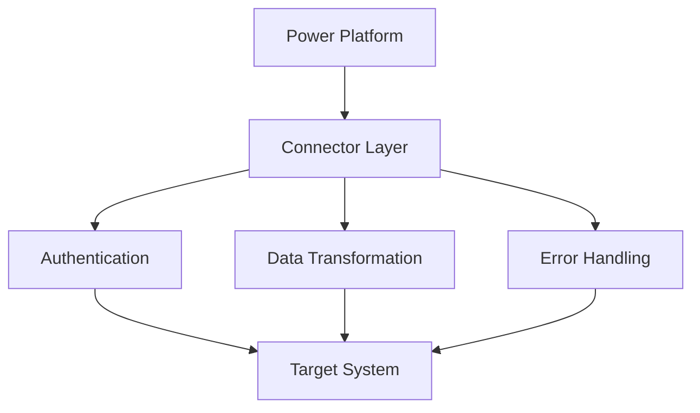

# Power Platform Integration Patterns

Comprehensive guide to integration architectures, patterns, and best practices for connecting Power Platform with Microsoft 365, Azure, and third-party systems.

## 🔗 Integration Architecture Overview

### Integration Ecosystem
```
┌─────────────────────────────────────────────────────────────┐
│                    Power Platform                          │
├─────────────────────────────────────────────────────────────┤
│   Microsoft 365  │   Azure Services  │  Third-party APIs   │
├─────────────────────────────────────────────────────────────┤
│              On-premises Systems                           │
└─────────────────────────────────────────────────────────────┘
```

### Integration Capabilities

| Integration Type | Method | Use Cases | Complexity |
|------------------|--------|-----------|------------|
| **Real-time** | API calls, webhooks | Immediate data sync | Medium |
| **Batch** | Scheduled flows, bulk operations | Large data transfers | Low |
| **Event-driven** | Triggers, notifications | Process automation | Medium |
| **Hybrid** | Data gateways, VPN | On-premises connectivity | High |

## 📂 Section Contents

- **[Connector Patterns](./connector-patterns/README.md)** - Standard and custom connector implementations
- **[API Integration](./api-integration/README.md)** - REST and SOAP API connectivity patterns
- **[Data Synchronization](./data-synchronization/README.md)** - Data flow and sync strategies
- **[Event-Driven Architecture](./event-driven/README.md)** - Reactive integration patterns
- **[Hybrid Connectivity](./hybrid-connectivity/README.md)** - On-premises integration approaches
- **[Error Handling & Resilience](./error-handling/README.md)** - Robust integration practices
- **[Security & Authentication](./security-auth/README.md)** - Secure integration implementation
- **[Performance & Scalability](./performance/README.md)** - High-performance integration patterns

## 🔌 Connector Architecture

### Connector Types

#### Standard Connectors
- **Microsoft Services**: Office 365, Azure, Dynamics 365
- **Popular SaaS**: Salesforce, ServiceNow, SharePoint
- **Social Media**: Twitter, Facebook, LinkedIn
- **Productivity**: Slack, Trello, Asana

#### Premium Connectors
- **Enterprise Systems**: SAP, Oracle, IBM
- **Database Connectors**: SQL Server, Oracle, MySQL
- **Cloud Services**: AWS, Google Cloud
- **Industry-specific**: Healthcare, Finance, Manufacturing

#### Custom Connectors
- **API Wrapper**: OpenAPI/Swagger definitions
- **Authentication**: OAuth, API key, certificate
- **Data Transformation**: Input/output mapping
- **Error Handling**: Custom error responses

### Connector Implementation Patterns



## 🏗️ Integration Patterns

### Synchronous Integration
- **Request-Response**: Immediate data exchange
- **API Calls**: Direct service invocation
- **User-Initiated**: Interactive operations
- **Real-time Validation**: Immediate feedback

### Asynchronous Integration
- **Message Queues**: Decoupled communication
- **Event Streaming**: Continuous data flow
- **Batch Processing**: Scheduled operations
- **Fire-and-Forget**: Non-blocking operations

### Hybrid Integration
- **Data Gateways**: On-premises connectivity
- **VPN Tunnels**: Secure network connections
- **Express Route**: Dedicated network paths
- **Service Bus**: Message relay services

## 📊 Data Integration Strategies

### Data Flow Patterns

#### One-Way Sync
```
Source System → Power Platform
```
- **Use Case**: Data consumption, reporting
- **Examples**: CRM to Power BI, ERP to Power Apps

#### Two-Way Sync
```
System A ↔ Power Platform ↔ System B
```
- **Use Case**: Data consistency across systems
- **Examples**: Contact synchronization, inventory updates

#### Hub and Spoke
```
    System A
        ↓
Power Platform (Hub)
    ↓     ↓
System B  System C
```
- **Use Case**: Central data orchestration
- **Examples**: Master data management, workflow coordination

### Data Transformation
- **Field Mapping**: Source to target field alignment
- **Data Type Conversion**: Format standardization
- **Business Logic**: Calculation and derivation
- **Data Cleansing**: Quality improvement

## 🔐 Security & Authentication

### Authentication Methods

| Method | Use Case | Security Level | Implementation |
|--------|----------|----------------|----------------|
| **OAuth 2.0** | Modern APIs | High | Token-based |
| **API Key** | Simple services | Medium | Header/query parameter |
| **Basic Auth** | Legacy systems | Low | Username/password |
| **Certificate** | Enterprise systems | High | Client certificates |

### Security Best Practices
- **Principle of Least Privilege**: Minimal required permissions
- **Token Management**: Secure storage and renewal
- **Data Encryption**: End-to-end protection
- **Audit Logging**: Comprehensive activity tracking

## ⚡ Performance Optimization

### Optimization Strategies
- **Connection Pooling**: Reuse established connections
- **Caching**: Reduce redundant API calls
- **Batch Operations**: Group multiple requests
- **Async Processing**: Non-blocking operations

### Throttling & Rate Limiting
- **Request Limits**: API call quotas
- **Retry Logic**: Exponential backoff
- **Circuit Breakers**: Failure protection
- **Load Balancing**: Distribute request load

## 🚨 Error Handling & Resilience

### Error Handling Patterns

#### Retry Pattern
```
Request → Failure → Wait → Retry → Success/Fail
```

#### Circuit Breaker Pattern
```
Healthy → Failure Threshold → Open → Half-Open → Closed
```

#### Bulkhead Pattern
```
Critical Services ═══ Non-Critical Services
     (Isolated)           (Isolated)
```

### Resilience Strategies
- **Timeout Configuration**: Prevent hanging requests
- **Dead Letter Queues**: Failed message handling
- **Fallback Mechanisms**: Alternative processing paths
- **Health Monitoring**: System status tracking

## 📋 Integration Templates & Examples

- [Standard API Integration Template](./templates/api-integration-template.md)
- [Data Synchronization Template](./templates/data-sync-template.md)
- [Custom Connector Template](./templates/custom-connector-template.md)
- [Error Handling Template](./templates/error-handling-template.md)

## 🔗 Platform-Specific Integration

### Power Apps Integration
- **External Data Sources**: Database and API connectivity
- **Real-time Updates**: Live data synchronization
- **Offline Capabilities**: Local data caching
- **Custom Controls**: Enhanced UI integration

### Power Automate Integration
- **Trigger Patterns**: Event-driven automation
- **Action Chains**: Sequential service calls
- **Parallel Processing**: Concurrent operations
- **Condition Logic**: Dynamic flow control

### Power BI Integration
- **Data Refresh**: Scheduled and real-time updates
- **Streaming Datasets**: Live data feeds
- **Custom Visuals**: External service integration
- **Embedded Analytics**: Application integration

### Dataverse Integration
- **Virtual Tables**: External data virtualization
- **Dual-write**: Real-time synchronization
- **Data Export**: Bulk data extraction
- **Web API**: Programmatic access

## 🔗 Related Sections

- [API Management](../api-management/README.md) - API strategy and governance
- [Data Integration](../data-integration/README.md) - Data connectivity patterns
- [Security Framework](../security/README.md) - Secure integration practices
- [DevOps & ALM](../devops/README.md) - Integration deployment patterns

---
**Next**: [Connector Patterns](./connector-patterns/README.md)
