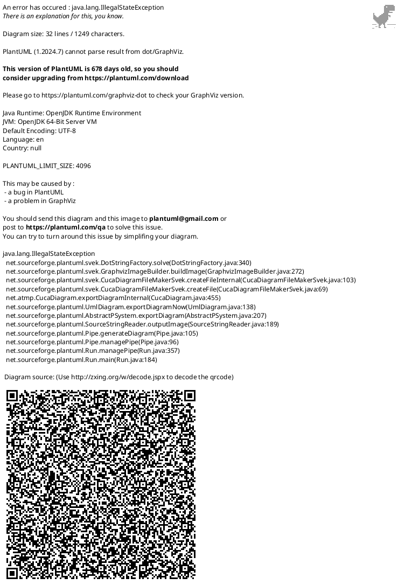

# Developer Landing Zone Architectural Pattern

| Attribute                  | Value                          |
|---------------------------|---------------------------------|
| Pattern Name              | Developer Landing Zone Pattern |
| Architecture Continuum    | Common Systems Architecture     |
| Domain                    | Identity & Access Management    |
| Reusability               | High                            |
| Applicable Layers         | Application, Technology         |

## Intent
Provide a secure, automated, and reusable approach for onboarding and offboarding developers into isolated landing zones within a dedicated Azure tenant, leveraging identity governance, access packages, and automation.

## Context
- Organizations require isolated environments for development activities, often in separate Azure tenants.
- Access must be controlled, auditable, and limited to authorized corporate users.
- Developer onboarding/offboarding should be automated to reduce manual effort and risk.

## Principles
- **Least Privilege**: Users are granted only the access necessary for their role and tasks.
- **Separation of Duties**: Administrative and user roles are clearly separated to reduce risk.
- **Automated Governance**: All onboarding and offboarding actions are automated and auditable.
- **Scalability**: The pattern supports growth in users, landing zones, and resources without redesign.
- **Interoperability**: Integrates with existing corporate identity and resource management systems.
- **Resilience**: Handles errors and exceptions gracefully, ensuring consistent state and notifications.
- **Compliance**: Aligns with organizational and regulatory requirements for identity and access management.
- **Security**: Only authorized users from the corporate tenant should access developer resources.
- **Automation**: Minimize manual provisioning and deprovisioning steps.
- **Auditability**: All access and changes must be tracked.
- **Scalability**: The pattern should support multiple landing zones and users.
- **User Experience**: Developers should have a seamless experience accessing resources.

### Architecture Layers Diagram

## Pattern

### Key Components

1. **Developer Tenant**
   - Azure Entra P2 for advanced identity governance and access packages.
   - Dedicated for developer resources.

2. **Access Packages**
   - Restrict access to users from the corporate tenant.
   - Approval workflow (manual or automatic).
   - Assign users to Office 365 Group and SharePoint Communication Site.

3. **Office 365 Group**
   - Membership managed by Access Package assignment.
   - Triggers Power Automate flows on add/remove.

4. **SharePoint Communication Site**
   - Hosts resources and documentation for developers.
   - Accessible with corporate credentials via B2B collaboration.

5. **Power Automate Flows**
   - Onboarding: Create/enable DLZ user, email credentials, add to security group.
   - Offboarding: Remove DLZ user from security group, disable if not in other groups, notify user.

6. **Security Groups**
   - Control access to developer landing zone resources.
   - Managed by Power Automate flows.

### Onboarding Flow

### Removal/Offboarding Flow

## Consequences
- **Pros:**
  - Automated, auditable onboarding/offboarding.
  - Secure access for corporate users only.
  - Scalable for multiple landing zones.
  - Reduces manual errors and administrative overhead.
- **Cons:**
  - Requires Azure Entra P2 licensing.
  - Initial setup of automation and access packages can be complex.

## Configuration Options

| Component                | Option/Setting                                  | Description                                    |
|--------------------------|-------------------------------------------------|------------------------------------------------|
| Access Package           | External User Restriction                       | Only allow corporate tenant users              |
| Access Package           | Approval Workflow                               | Manual or automatic approval                   |
| Access Package           | Assignment Duration                             | Time-bound or permanent                        |
| Office 365 Group         | Membership Type                                 | Dynamic or static                              |
| SharePoint Site          | Permissions                                     | Read/Write/Owner roles                         |
| Power Automate           | Notification Settings                           | Email templates, recipients                    |
| Security Group           | Resource Assignment                             | Linked to landing zone resources               |

## References
- [Azure AD Entitlement Management](https://learn.microsoft.com/en-us/azure/active-directory/governance/entitlement-management-access-packages)
- [Microsoft 365 Groups](https://learn.microsoft.com/en-us/microsoft-365/groups/overview)
- [SharePoint Communication Sites](https://learn.microsoft.com/en-us/sharepoint/communication-sites)
- [Power Automate](https://learn.microsoft.com/en-us/power-automate/)
- [Azure AD Security Groups](https://learn.microsoft.com/en-us/azure/active-directory/fundamentals/active-directory-groups-create-azure-portal)

## Summary
This architectural pattern enables secure, automated onboarding and offboarding of developers into isolated landing zones, leveraging Azure Entra P2, Access Packages, Office 365 Groups, SharePoint, and Power Automate. It is designed for reusability, scalability, and compliance in enterprise environments.
