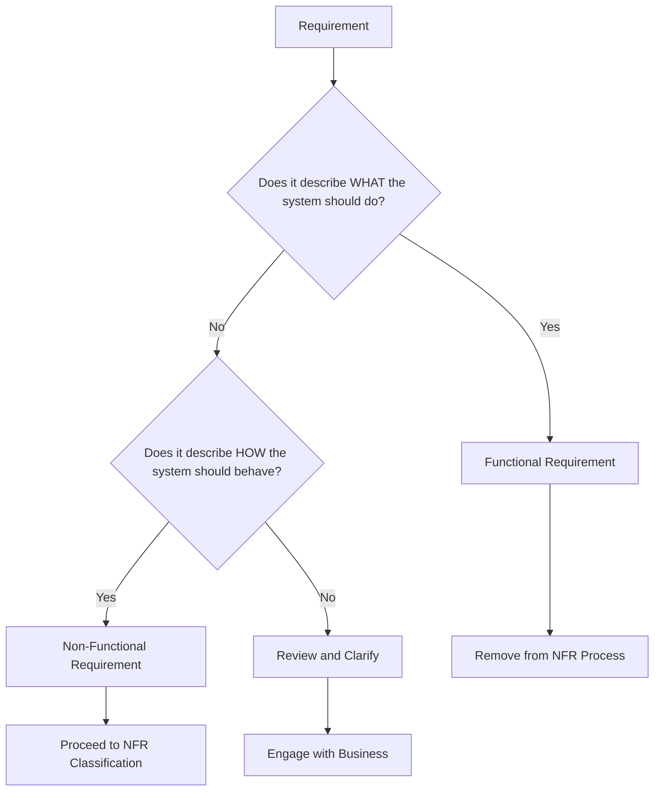
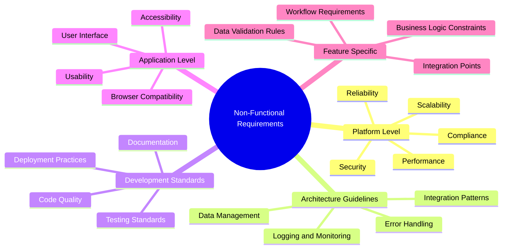
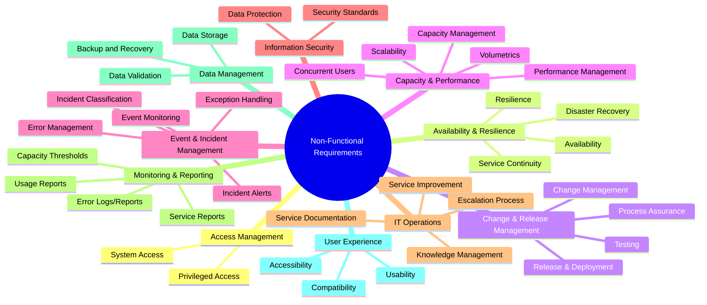
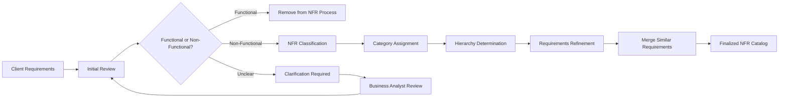
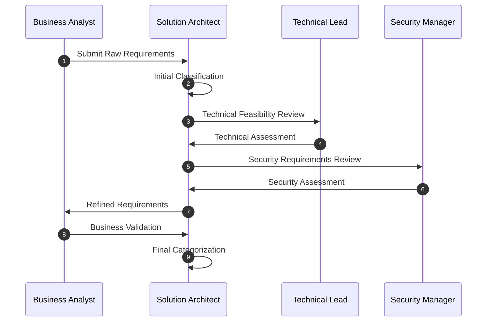
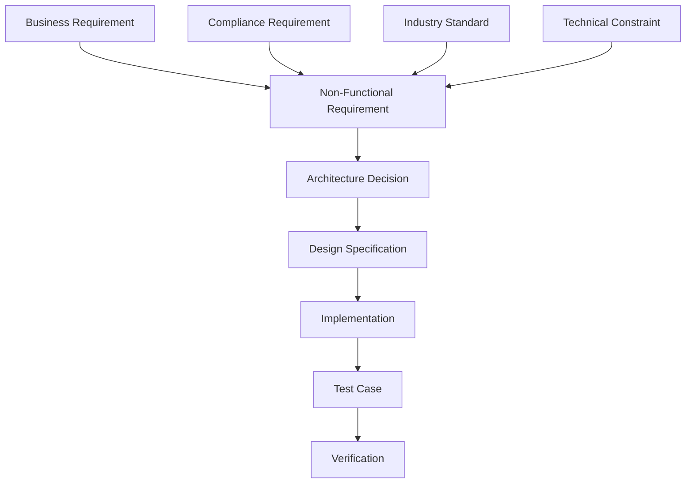
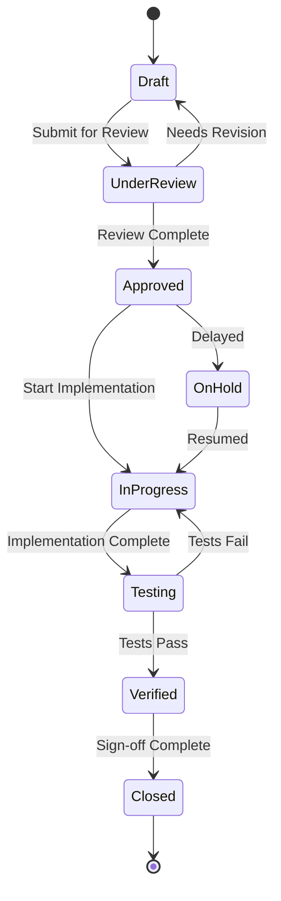

### Description

This document outlines the approach for organizing, categorizing, and processing non-functional requirements (NFRs) within the Power Platform ecosystem. It provides a structured methodology for distinguishing between functional and non-functional requirements, and establishes a hierarchy for organizing NFRs across different architectural levels.

### Out of Scope

- Specific implementation details for individual NFRs
- Functional requirement analysis
- Tool-specific configuration details

### Key Touch points with other guidelines

- **Architecture Guidelines:** Establishes standards that apply across all features
- **Development Standards:** Defines coding and development practices
- **Security Framework:** Integrates security requirements across all levels
- **User Experience Standards:** Defines front-end and accessibility requirements

## Non-Functional Requirements Framework

### Definition and Scope

**Non-Functional Requirements (NFRs)** define how a system performs its functions rather than what it does. They specify quality attributes, constraints, and system-wide behaviors that cut across functional boundaries.

**Key Characteristics:**
- Define system quality attributes (performance, security, usability)
- Apply to system behavior rather than specific features
- Often measurable and testable
- Impact multiple functional areas
- Influence architectural decisions

## Requirements Classification Process

### Step 1: Functional vs Non-Functional Separation

The first step involves distinguishing between functional and non-functional requirements using the following criteria:



### Step 2: Non-Functional Requirements Architectural Layers

Once identified as NFRs, requirements are categorized into the following hierarchy:



### Step 3: Non-Functional Requirements Domain Categorisation

Once identified as NFRs, requirements are categorized into the following hierarchy:




## NFR Architectural Layers


### 1. Platform/Product Level NFRs

**Scope:** System-wide requirements that affect the entire Power Platform solution.

**Categories:**
- **Performance:** Response times, throughput, resource utilization
- **Scalability:** User load, data volume, transaction capacity
- **Reliability:** Uptime, fault tolerance, disaster recovery
- **Security:** Authentication, authorization, data protection
- **Compliance:** Regulatory requirements, audit trails, data governance

**Examples:**
- "System must support 1000 concurrent users"
- "All data must be encrypted at rest and in transit"
- "System uptime must be 99.9%"

### 2. Architecture Guidelines

**Scope:** Cross-cutting concerns that influence architectural decisions across all applications and features.

**Categories:**
- **Integration Patterns:** API design, messaging, data synchronization
- **Data Management:** Data consistency, backup, archival
- **Error Handling:** Exception management, user notifications
- **Logging and Monitoring:** Audit trails, performance metrics, alerting

**Examples:**
- "All integrations must use standardized REST APIs"
- "Error messages must not expose sensitive information"
- "All user actions must be logged for audit purposes"

### 3. Development Standards

**Scope:** Requirements that govern how software is developed, tested, and deployed.

**Categories:**
- **Code Quality:** Coding standards, code reviews, static analysis
- **Testing Standards:** Unit testing, integration testing, user acceptance testing
- **Deployment Practices:** CI/CD pipelines, environment management
- **Documentation:** Code documentation, API documentation, user guides

**Examples:**
- "All code must achieve 80% test coverage"
- "Deployments must be automated and repeatable"
- "All APIs must be documented using OpenAPI specification"

### 4. Application Level NFRs

**Scope:** Requirements specific to user-facing applications and interfaces.

**Categories:**
- **User Interface:** Design consistency, responsiveness, navigation
- **Accessibility:** WCAG compliance, screen reader support, keyboard navigation
- **Usability:** User experience, workflow efficiency, help systems
- **Browser Compatibility:** Supported browsers, mobile responsiveness

**Examples:**
- "Application must comply with WCAG 2.1 AA standards"
- "Pages must load within 3 seconds on standard hardware"
- "Interface must be responsive across desktop, tablet, and mobile devices"

### 5. Feature Specific NFRs

**Scope:** Requirements that apply to specific business features or functional areas.

**Categories:**
- **Business Logic Constraints:** Validation rules, workflow requirements
- **Data Validation Rules:** Input validation, data format requirements
- **Integration Points:** Third-party system interactions, data exchange formats
- **Workflow Requirements:** Process timing, approval chains, notifications

**Examples:**
- "Case processing workflow must complete within 24 hours"
- "Document uploads must be virus-scanned before storage"
- "Financial calculations must be accurate to 2 decimal places"


## NFR Domain Categorisation

### 1. Access Management
- **Privileged Access:** Requirements for administrative access controls and management
- **System Access:** User authentication, authorization, and account management requirements

### 2. Availability & Resilience
- **Availability:** System uptime requirements and service level objectives
- **Resilience:** System's ability to maintain service during disruptions
- **Service Continuity:** Business continuity planning and implementation
- **Disaster Recovery:** Recovery point/time objectives and disaster response procedures

### 3. Change & Release Management
- **Change Management:** Requirements for managing system changes
- **Process Assurance:** Quality gates and approval workflows
- **Release & Deployment:** Requirements for deployment processes
- **Testing:** Testing requirements for changes and releases

### 4. Capacity & Performance
- **Concurrent Users:** Number of simultaneous users the system must support
- **Capacity Management:** Resource allocation and scaling requirements
- **Performance Management:** Response times, rendering speeds, and processing times
- **Scalability:** Requirements for scaling resources based on demand
- **Volumetrics:** Data volume requirements and projections

### 5. Event & Incident Management
- **Event Monitoring:** System event logging and monitoring requirements
- **Exception Handling:** Requirements for handling exceptional conditions
- **Error Management:** Error logging, reporting, and resolution
- **Incident Alerts:** Alerting thresholds and notification requirements
- **Incident Classification:** Requirements for categorizing and prioritizing incidents

#### 6. Information Security
- **Security Standards:** Compliance with security frameworks and standards
- **Data Protection:** Requirements for data encryption and protection

### 7. IT Operations
- **Service Improvement:** Continuous improvement requirements
- **Service Documentation:** Documentation standards and requirements
- **Escalation Process:** Requirements for issue escalation procedures
- **Knowledge Management:** Requirements for maintaining operational knowledge

### 8. Monitoring & Reporting
- **Error Logs/Reports:** Requirements for error tracking and reporting
- **Capacity Thresholds:** Monitoring thresholds and alerts
- **Usage Reports:** Requirements for usage statistics and reporting
- **Service Reports:** Service level reporting requirements

### 9. Data Management
- **Backup and Recovery:** Data backup frequency and recovery requirements
- **Data Storage:** Requirements for data retention and storage
- **Data Validation:** Requirements for ensuring data integrity

### 10. User Experience
- **Usability:** Requirements for user interface design and user experience
- **Accessibility:** Compliance with accessibility standards
- **Compatibility:** Browser, device, and platform compatibility requirements

## Mapping Between Categorization Approaches

The following matrix shows how the architectural layers and service management categories relate to each other:

| Service Management Category | Platform Level | Architecture Guidelines | Development Standards | Application Level | Feature Specific |
|----------------------------|----------------|-------------------------|----------------------|-------------------|-----------------|
| Access Management          | ✓              | ✓                       |                      |                   | ✓               |
| Availability & Resilience  | ✓              | ✓                       |                      |                   |                 |
| Change & Release Management|                | ✓                       | ✓                    |                   |                 |
| Capacity & Performance     | ✓              |                         |                      | ✓                 |                 |
| Event & Incident Management|                | ✓                       | ✓                    |                   |                 |
| Information Security       | ✓              | ✓                       |                      |                   |                 |
| IT Operations              |                | ✓                       | ✓                    |                   |                 |
| Monitoring & Reporting     |                | ✓                       |                      |                   | ✓               |
| Data Management            | ✓              | ✓                       |                      |                   | ✓               |
| User Experience            |                |                         |                      | ✓                 | ✓               |

## NFR Processing Workflow

### Requirements Intake and Analysis



### Requirements Refinement Process



## Implementation Guidelines

### Requirements Documentation

Each NFR should be documented with the following attributes:

**Required Fields:**
- **ID:** Unique identifier
- **Title:** Descriptive name
- **Category:** Platform, Architecture, Development, Application, or Feature
- **Priority:** Critical, High, Medium, Low
- **Description:** Detailed requirement statement
- **Acceptance Criteria:** Measurable success criteria
- **Impact:** Affected components and systems
- **Dependencies:** Related requirements or constraints

**Optional Fields:**
- **Rationale:** Business justification
- **Testing Approach:** How compliance will be verified
- **Implementation Notes:** Technical considerations
- **Risks:** Potential challenges or limitations

### Traceability Matrix



### Quality Gates

**Requirements Review Gates:**
1. **Business Alignment:** Ensures NFRs support business objectives
2. **Technical Feasibility:** Validates technical achievability within constraints
3. **Security Compliance:** Confirms security requirements are addressed
4. **Cost-Benefit Analysis:** Evaluates implementation cost vs. benefit
5. **Acceptance Criteria:** Ensures requirements are testable and measurable

## NFR Management Process

### Lifecycle Management



### Governance Framework

**Roles and Responsibilities:**
- **Solution Architect:** Overall NFR framework ownership and classification
- **Technical Lead:** Technical feasibility and implementation guidance
- **Security Architect:** Security-related NFR validation
- **Business Analyst:** Business alignment and functional requirement separation
- **Development Team:** Implementation and testing responsibility
- **Quality Assurance:** Verification and validation of NFR compliance

### Monitoring and Compliance

**Ongoing Activities:**
- Regular NFR compliance audits
- Performance monitoring against defined thresholds
- Requirements traceability verification
- Stakeholder feedback collection
- Continuous improvement of the NFR framework

## Tools and Templates

### Recommended Tools

**Requirements Management:**
- Work Items for tracking
- WiKi for documentation
- Excel for requirements matrices

**Testing and Validation:**
- Automated testing frameworks for performance NFRs
- Security scanning tools for compliance
- Accessibility testing tools for UI requirements

### Templates

**NFR Template Structure:**
```markdown
## NFR-{ID}: {Title}

**Category:** [Platform/Architecture/Development/Application/Feature]
**Priority:** [Critical/High/Medium/Low]
**Status:** [Draft/Under Review/Approved/In Progress/Verified/Closed]

### Description
[Detailed requirement statement]

### Acceptance Criteria
- [ ] Criterion 1
- [ ] Criterion 2
- [ ] Criterion 3

### Impact Assessment
**Affected Components:**
- Component 1
- Component 2

**Dependencies:**
- Dependency 1
- Dependency 2

### Implementation Notes
[Technical considerations and constraints]

### Testing Approach
[How compliance will be verified]
```

## Glossary

**Acceptance Criteria:** Specific, measurable conditions that must be met for an NFR to be considered satisfied.

**Architecture Guidelines:** High-level principles and patterns that guide architectural decisions across the entire solution.

**Cross-Cutting Concerns:** System aspects that affect multiple functional areas, such as security, logging, and error handling.

**Non-Functional Requirement (NFR):** A requirement that specifies criteria for system operation rather than specific behaviors or functions.

**Quality Attributes:** Measurable characteristics of a system such as performance, reliability, usability, and security.

**Requirements Traceability:** The ability to track relationships between requirements, design decisions, implementation, and testing.

**System-Wide Requirements:** NFRs that apply to the entire system rather than specific features or components.


